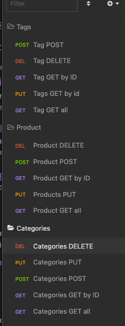

# e-commerce-back-end

## Description

The e-commerce back-end project provides routes and models.

## Table of Contents

- [Installation](#Installation)
- [Usage](#Usage)
- [Contributions](#Contributions)
- [Testing](#Testing)
- [License](#License)
- [Questions](#Questions)

## Installation

The user must clone the remote repository onto their computer and use the server to test routes.

## Usage

Provides back end code to e-commerce application.

## Contributions

No contributions.

## Testing

After cloning the remote repository onto your computer open in desired code editor and use the terminal to open the server. Test the project by answering the prompt questions and creating a test routes.

## License

This project has an MIT license.
https://opensource.org/licenses/MIT

## Walkthrough Videos:

https://watch.screencastify.com/v/MIHmL1mes99khOQXgI0H
https://watch.screencastify.com/v/0RMy0hGHhqHZvvLQ9IYk

## Questions

Need to reach me?

- Email: michvalenz27@gmail.com
- [GitHub](https://github.com/MichValenz/e-commerce-back-end)
